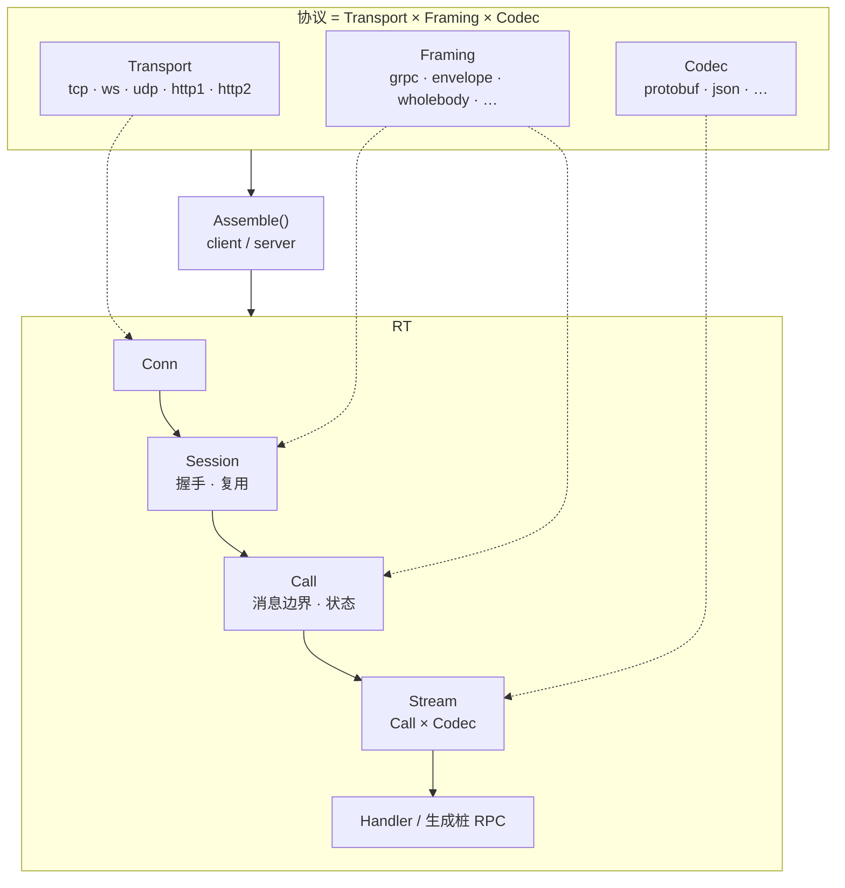

# Argos

**可组装的 RPC 运行时**：用 **Transport × Framing × Codec** 三轴拼出你要的线上协议，而不是绑死在某一种「官方栈」上。

Argos 把 **连接和会话（`Conn` / `Session`）** 放在 API 中心——握手、复用、池化都有明确模型；**一次调用和长流共用同一套抽象**（unary 就是只跑一条消息的流）。你可以走和标准 **gRPC** 互通的组合，也可以走 TCP 自有线格式、HTTP/1 整包、UDP 单包往返等路径；**组合不合法会直接失败**，不会悄悄换协议。

> **定位**：验证「协议真的可以这么组装」的研究型运行时，**不是**面向生产的通用 RPC 框架。行为以代码与测试为准。

## 架构一览

三轴在 `ServiceConfig` 里**并排选配**，由 `client` / `server` **组装**；线上走 **Conn → Session → Call → Stream**（unary 即单元素 Stream）。概念与包依赖见 [architecture.md](docs/architecture.md)。



---

## 和常见框架的差别

| | **Argos** | **典型做法（如 grpc-go）** |
|---|---|---|
| 协议怎么定 | 三轴显式选配，组合层无全局 registry | 固定 HTTP/2 + gRPC 栈 |
| 扩展方式 | 实现 Transport / Framing / Codec 窄接口并挂工厂 | 多在现有栈上打补丁或换 transport |
| 连接模型 | `Conn` → `Session` → `Call` 一等建模 | 多隐藏在 channel / stream 实现里 |
| 流式 vs unary | 同一条路径 | 常有两套 API 或语义分叉 |
| 目标 | 证明多种形状可组装、可测 | 生产可用、生态完整 |

内置已验证组合（含 gRPC、envelope、wholebody 及 `example/resp`、`example/synth`）见 **[兼容性矩阵](docs/compatibility-matrix.md)**。

---

## 快速开始

[`example/echo`](example/echo) 演示同一服务多种传输；三轴预设见 [`example/echo/axes.go`](example/echo/axes.go)。

```go
tr, fr, cd := echov1.GRPCAxes() // http2 + grpc + protobuf

srv := server.New(
    argos.WithService("echo.v1.EchoService",
        argos.ServiceTransport(tr), argos.ServiceFraming(fr), argos.ServiceCodec(cd),
        argos.ServiceListenAddress(":7001"),
    ),
)
_ = echov1.RegisterEchoService(srv, impl)
go srv.Run(ctx)

ec, _ := echov1.NewEchoServiceClient(
    argos.JoinClient(argos.WithTransport(tr), argos.WithFraming(fr), argos.WithCodec(cd)),
    argos.WithTarget("ip://127.0.0.1:7001"),
)
defer ec.Close()
_, _ = ec.Echo(ctx, &echov1.EchoRequest{Msg: "hi"})
```

- 服务端：`RegisterXxxService` 挂业务实现（路由），与三轴无关。
- 不用生成桩时：`client.New` + `Open(ctx, method)`，见 [codec-and-wiring.md](docs/codec-and-wiring.md)。
- 从 proto 生成桩：`go run ./cmd/argos generate stub ...`，见 [codegen.md](docs/codegen.md)。

---

## 文档

| 想了解… | 阅读 |
|---|---|
| 目标、概念、包依赖 | [architecture.md](docs/architecture.md) |
| 扩展三轴、挂到 client/server | [overview.md](docs/overview.md) → [transport](docs/transport.md) / [framing](docs/framing.md) / [codec-and-wiring](docs/codec-and-wiring.md) |
| 选哪种 Transport × Framing | [compatibility-matrix.md](docs/compatibility-matrix.md) |
| 配置、运行时路径、错误、调用约定 | [usage.md](docs/usage.md) |
| 代码生成 | [codegen.md](docs/codegen.md) |
| 文档索引 | [docs/README.md](docs/README.md) |
| 在本仓库改代码的代理约定 | [AGENTS.md](AGENTS.md) |

---

## 开发

```bash
make verify
```

提交前应全绿；命令说明与环境变量见 [usage.md](docs/usage.md#本地验证)。
